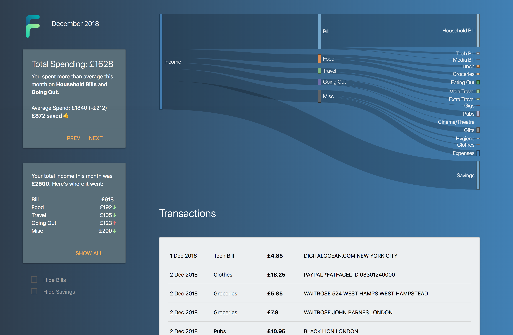
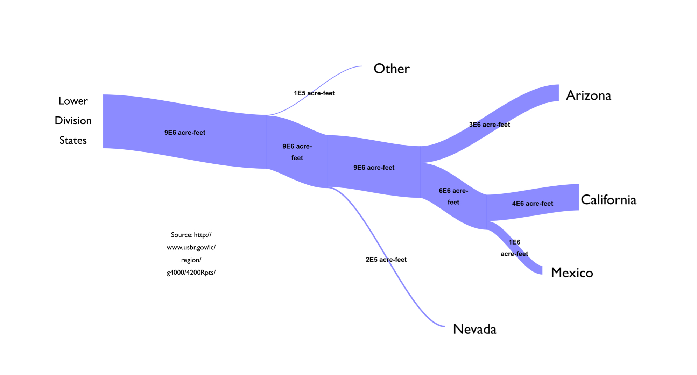
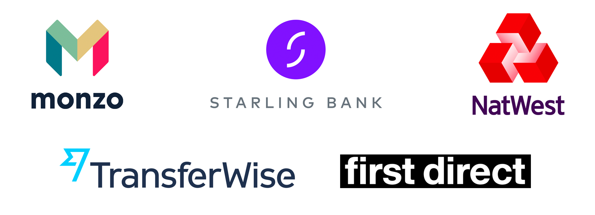
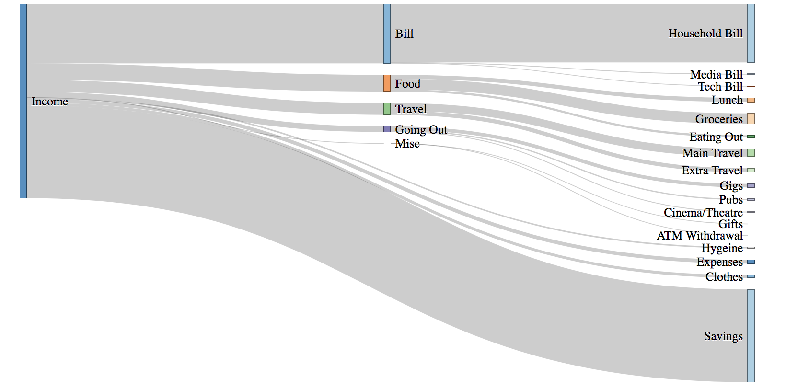
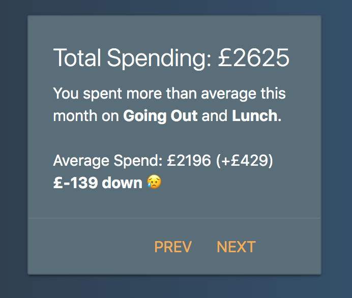
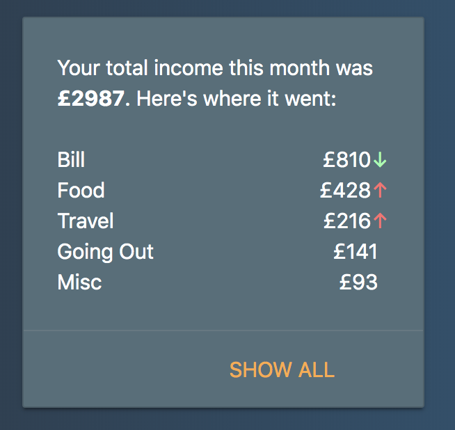
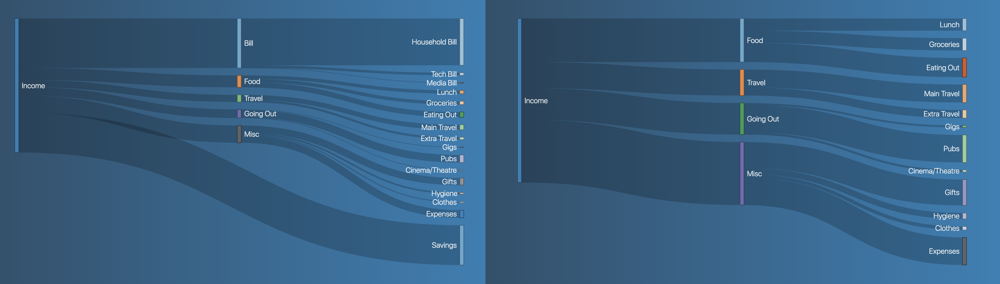
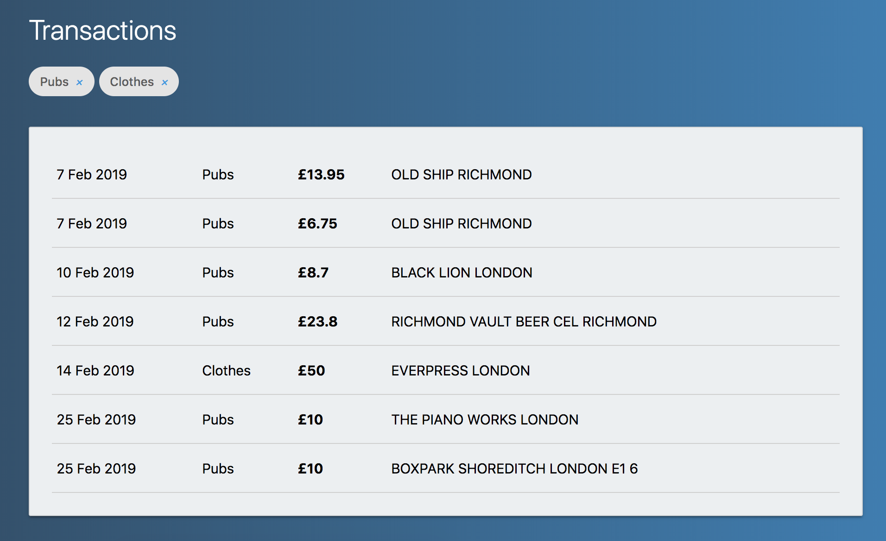
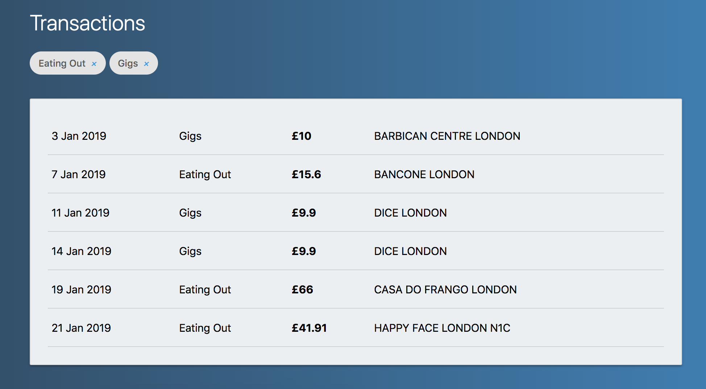

<p align="center">

</p>

> A prototype personal finance visualisation tool created in response to the introduction of PSD2 regulations in January 2018. Designed to be a companion to existing financial dashboards, Finflow is a project motivated by a desire to explore the opportunities of Open Banking, as well as a personal challenge to obtain deeper knowledge of Javascript & D3.

Finflow is a prototype visualisation tool for exploring categorised spending data. Features include:
* Dynamically generated Sankey visualisation
* Transaction filtering using visualisation interactivity
* Monthly spending summaries with category breakdowns



*Note:* Screenshots in this README have been adjusted so real values aren't used.  (Sorry, Cambridge Analytica 😇)


### Background
With large changes looming across the European payments market in January 2018, the month before I started thinking about the opportunities of finally having financial data from  multiple financial institutions combined in a single location:
- What would I want to see if I could see my entire financial life in one tool?
- How would I position and visualise the data for insights to be meaningful?
- What would make this tool unique beyond existing personal finance dashboards like [MoneyDashboard](https://www.moneydashboard.com/) and rising challenger apps like [Emma](https://emma-app.com/)?

I quickly came to the conclusion that what I had planned was not going to be a replacement for these services; rather a companion – at least initially – while external APIs across financial institutions were in their infancy. In addition, through my [dissertation](https://github.com/Millais/VirtualRealityExplorer/) I had read many papers speak of habituation issues with new quantified self platforms. This tool was therefore not intended as the direct entry point to my financial life, but purposefully designed as a supplementary visualisation tool to existing platforms.

##### Specifics
December 2017 saw an influx of salary-related posts on [r/dataisbeautiful](https://www.reddit.com/r/dataisbeautiful/) based on Sankey diagrams. These diagrams clearly articulate complex datasets with connections for multi-layered data. Flows of financial data (hence: _Finflow_) can be isolated from a wider dataset for deeper analysis. With plenty of interaction possibilities based around this – as well as a distinct visualisation design – the Sankey diagram appeared to be the natural choice for visualising my financial data. At the time, no major budgeting platform made use of this visualisation technique.


*Example Sankey diagram [from Wikipedia](https://commons.wikimedia.org/wiki/File:Sankey_Diagram_of_Colorado_River_Water_Use.jpg) beginning with a set input (i.e income) and shows various outputs flowing off (i.e spending categories)*

Next up was the method to generate a Sankey diagram. Many of the Sankey posts on Reddit were created with SankeyMatic which is great for one-time visualisations. However, ultimately these diagrams were static. Changes to any underlying data sources required a manual effort to re-process the data and plug the values back into SankeyMatic. I wanted a way to dynamically generate Sankey diagrams based on my latest spending data, without manual reentry effort every time the data was changed. The following setup enabled me to achieve this:
- Google Spreadsheet holding all my spending data
- The [D3.js](https://d3js.org/) library for dynamically generating Sankey diagrams
- A Node server sitting in the middle: retrieving the latest transactional data from my spreadsheet using the Google Sheets API, pre-processing the data into a D3-readable format, and exposing an endpoint for the client to retrieve JSON for rendering the Sankey diagram using D3. 


### First Challenges

#### Collating spending data




Combining financial data is an absolute pain.  All my financial institutions (banks, credit cards, saving accounts) provided data in totally different file formats all with varying contents.  Ideally I wanted an API to integrate against from each financial institution. However, only one of my banks provided this at the time. Other financial institutions did not have a public API, or required you to be an Account Information Service Provider (AISP) to access your data via their API.

[Teller](https://teller.io/) was a single API solution that connected to a number of top UK banks to retrieve your data. However, this solution stored your bank details and then screen-scraped. With a lack of financial protection around screen-scraping at the point of designing the prototype I quickly ruled this out (legislation has since evolved). [Plaid](https://plaid.com/uk/) has emerged as the victor in this area – turns out [partnering with banks works](https://news.ycombinator.com/item?id=14608567) (who knew?!) – but Plaid had no connections to UK banks while I was designing the prototype.

Therefore it was a manual effort to aggregate my financial data into a master spreadsheet on Google Sheets. 

To make this process more efficient in the future, Monzo & Starling offer webhooks which I plan to use in conjunction with the Sheets API. This will instantly update the spreadsheet as I spend to alleviate the manual effort of exporting, importing and pre-processing bank transactions semi-regularly. However, most of my spending goes through an Amex credit card for the cashback. Unfortunately Amex require you to register as an [AISP](https://developer.americanexpress.com/open-banking) to get anywhere close to their APIs, so there's no quick wins here.


#### Categorising transactions

##### Labelling transactions


| Date  | Description      | Value |
|-------------|-----------------------------------------------------------------|--------|
| 9 Oct 2017  | 9753 05OCT17 CD , TAP TAVERN , RICHMOND , RICHMOND TW9 GB       | -19.6  |
| 10 Oct 2017 | THAMES WATER                                                    | -25    |
| 11 Oct 2017 | 9753 10OCT17 CD , MARKS AND SPENCER PLC , SACA , W HAMPSTEAD GB | -2.64  |
| 11 Oct 2017 | 2273 09OCT17 , PAYPAL *ASOSCOMLTD, 35314369001 GB               | -78.25 |

With 100+ transactions happening every month, I needed a way to automatically label transactions with their category in my spreadsheet. One challenge: I only had the descriptor from the bank statement to work off.

Monzo are an example of a bank that provide greater insights about merchants back to consumers – with stores geolocated in-app, and transactions automatically categorised as they come in. All of this relies on a central database of merchant information; ever-growing as millions of people feed transactional information in. In addition, Monzo allow crowd-sourced contributions, enabling a smaller population of their customers to update incorrect merchant names, locations and categories. 

However, Monzo haven't externalised this in a consumable API that can be used – most likely due to its data value (see this [Monzo internal tool](https://twitter.com/kieranmch/status/1084541014185000961) based on merchant data). Traditional banks also receive many data points about consumer transactions but like Monzo only a limited subset of this data is ever exposed back to customers. With a lack of data to go off – simply *date*, *description* and *value* – I needed a different approach altogether.

The method I chose to categorise transactions was a string-searching algorithm – a good old-fashioned way of finding a string within a larger set of strings. This allows a string like:

> 2273 09OCT17 , PAYPAL *ASOSCOMLTD, 35314369001 GB

to be compared against a set of merchant strings like:
> [Zara, Pull and Bear, ASOS, River Island]

and matched.

To support this, I manually created a fresh sheet in my spending spreadsheet to record *Rules*, assigning each merchant a category like so:

| Merchant        | Category        |
|--------------|----------------|
| Tap Tavern   | Pubs           |
| Vue | Cinema/Theatre |
| Zara         | Clothes        |
| ASOS         | Clothes        |
| Boots        | Hygiene        |

Now each string match would have an associated category. Finally I mapped the categorisation function over every item requiring a category to be assigned:

```
function getAllCategories(dirtyArray, rules){
	return dirtyArray.map(
		function(x) { return getCategory(x.toString(), rules); }
	);
}
```

and a majority of transactions were now categorised. As I defined more rules in my spreadsheet (e.g a rule defining *White Cross Richmond* as a *Pub*), the algorithm got better at predicting the correct category for each transaction. 

Building upon this, I added a way within [predict.js](server/predict.js) to surface more custom rules with *checkSpecialCategory()*. For example, I know that M&S in Richmond (where I work) should be labelled as *Lunch*, but an M&S elsewhere should be labelled as *Groceries*:

```
if (preliminaryCategory == "Food" && inLocation(dirtyString, "Richmond")){
	if (inRichmondLunchLocations(dirtyString)){
		return "Lunch";
	}else{
		return "Groceries";  
	}
	...
```

The combination of an expanding list of rules, plus additional custom rule-setting, allowed approximately 80% of transactions to be predicted. Setting condition based formatting in Google Sheets easily enabled any remaining *uncategorised* transactions to be spotted and manually categorised.  Admittedly this approach doesn't scale particularly well beyond this prototype but for the purposes of this small project it worked absolutely fine.

##### Category List & Representation

The next challenge was to define a definitive list of categories which would represent my spending.  Monzo transactions arrived pre-categorised, and I began by using this category list to label my spending. However, the categories available were not totally sufficient for the level of detail I wanted – I found myself splitting categories into subcategories, or abstracting away where not necessary. After several iterations I had a list which suited my current needs. But what about future needs?

Custom categories is one of the [highest rated Monzo forum ideas](https://community.monzo.com/t/custom-category-creation/45899) and is a topic pivotal to the continued use of apps like Monzo and Yolt. If users can't discover a certain level of insight based on their own personal data, they're unlikely to return to the app for specific budgeting features and wider usage. In addition, categories relevant today may be redundant tomorrow. Is the 'ATM Withdrawal' category really going to be significant enough to measure in 5 years time? Probably not. I therefore came to the conclusion that the list of categories simply couldn't be static – it had to be dynamic.

As a result I created a third sheet in my spending spreadsheet for *Categories* (alongside *Spending* & *Rules*). This contained a list of categories which I personally defined and is a list which can grow or shrink as the data needs. 

Next, I needed a way to represent these categories in D3. Each category could have subcategories, which could also have subcategories. Logically this lends itself to a tree data structure; a collection of nodes with parents represented hierarchically:

| ID        | Parent        |
|--------------|----------------|
| Income | *Null* |
|Bill|Income|
|Household Bill|Bill|
|Tech Bill|Bill|
|Media Bill|Bill|
|Food|Income|
|Lunch|Food|
|Groceries|Food|
|Eating Out|Food|
|Travel|Income|
|Main Travel|Travel|
|...|...|

The Node server then pulls the latest list of user-defined categories & subcategories via the Sheets API and uses these to build the Sankey diagram.

### Basic Prototype Onwards



With the data sources prepared, categories and rules defined, and Google Sheets API hooked up, it was time to start iterating over the first basic D3 Sankey diagram (above).
* **Visuals**: I made use of [Bootstrap](https://getbootstrap.com/) and [Materialize](https://materializecss.com/) to make it look like the design arrived in this century rather than the last. In particular, I organised the content around cards for separate, glanceable information.

* **Time Range**: Initially I let users pick their own time range for the data. However, I removed this in favour of month-only views. This enabled clear comparisons between different months – rather than comparing unequal time periods.

* **Empty States**: Often one of the last things to be thought about (it certainly was in my case) I added a design for months where there was no transactional data to [prevent user confusion](https://material.io/design/communication/empty-states.html#alternatives).

* **Contextual Information**: Sankey diagrams are excellent at representing proportions, but added contextual information was necessary to give the user an understanding of the actual value of the data. I included two cards on the dashboard:
    * **Monthly Overview**: containing high-level spending & saving figures. Furthermore, the card highlighted which categories the user spent over average in.

    * **Monthly Breakdown**: Spend by category, with the use of arrows as visual cues to show if the user was up or down against the running category average.
	
Monthly Overview             |  Monthly Breakdown
:-------------------------:|:-------------------------:
|   |   


* **Hide Categories**: One weakness of the early prototype was apparent as soon as I previewed my spending data – a large amount attributed to a single category could totally skew the visualisation e.g a big one-off purchase. I pinpointed two categories – *Bills* and *Savings* – whose inclusion occasionally made it difficult to obtain meaningful insights in my own data, and provided an option to hide these from the visualisation.



*Left: Before hidden categories applied. 
Right: Hidden categories applied – the rest of the dataset in proportion and easier to draw insights from.*

* **Spending Detail**:  I added the ability for users to view the transactions making up a particular category. The user has the option to click a flow/category in the Sankey diagram, and transactions from that category will be listed below (each category represented by a chip). Chips can then be hidden as necessary for further filtering in the transactions table.

Filter: Pubs, Clothes           |  Filter: Eating Out, Gigs 
:-------------------------:|:-------------------------:
|   |   

With all additional improvements in place, the final prototype dashboard looked like this:


### Optimisations & Future Work
* **Hidden Categories**. Enable any category to be temporarily hidden. I saw occasional abnormal amounts in *Bills* & *Savings* categories which skewed the visualisation for the entire month so I chose these categories as ones that could be hidden. However, these categories were highly biased towards my own data. Users should be able to hide any category. Fortunately the backend *graph/* endpoint is already built out to accept additional categories to hide – front-end support is just required.

* **Usability studies**. The real purpose of any visualisation tool is insight. I designed this as a companion tool for my _personal_ data and needs – and so far it's working. I've gained insights on spending habits between months; where my spending habits are unhealthy and discovering changes I need to make to meet personal goals. But I'm very aware that this prototype tool was designed with my needs in mind. How would it fare being used by others?

* **Automatic Insights**. Following from above, Finflow was designed in order for me to navigate to the insights I personally wanted to explore. For a broader audience though, insights would ideally be discovered automatically and relayed back to users, without them explicitly searching specific insights out. There's a first attempt at this in the current dashboard – *"You spent more than average this month on Household Bills and Lunch"* – but there are plenty more opportunities to add in additional automation e.g automatically emphasising over-spend in the Sankey visualisation itself.

* **Bill Sharing**. I make heavy usage of [Splitwise](https://www.splitwise.com/) with my friends and flatmates. If I pay for a meal costing £60 with two friends, I'll see their portion of the meal in my bank statement rather than just my own – and as a result my monthly spending in this category will go up. Currently I have to manually adjust these transactions before data is imported. Future work would look at using the Splitwise API to automatically analyse transactions on bank statements and adjust the prices where bills were split to only represent your own share of a bill. 

* **Guides & Goals**. There's an overload of financial budgeting advice out there (Money Saving Expert, Step Change, start with the [/r/ukpersonalfinance](https://www.reddit.com/r/UKPersonalFinance/) wiki and go down a rabbit hole...). Putting these resources inside the dashboard, directly against the user's financial data, would act as a nudge for users to learn more about managing money, setting goals, and where changes can be made in their own spending.


### Running FinFlow

##### Google Sheets Setup
My spreadsheet has three main sheets: Transactions, Categories & Rules.

*Categories:*
Contains a flat category mapping, with a second `parent` column for building the categories into a tree structure.

| ID     | Parent |
|--------|--------|
| Income |        |
| Bill   | Income |
...

*Rules:*
Contains a list of common merchants and their spending category.

| Value          | Category |
|----------------|----------|
| Dice           | Gigs     |
| Leon            | Lunch    |
...

*Transactions:*
Contains a list of transactions with a `predicted` category and (actual) category. See below.

| Date       | Description                           | Value | Category | Predicted Category |
|------------|---------------------------------------|-------|----------|--------------------|
| 1 Sep 2017 | DICE | -9.5  | Gigs     | Gigs               |
| 1 Sep 2017 | 9753 31AUG17 CD , MARKS AND SPENCER PLC , RICHMOND GB | -3.9 | Lunch     | Lunch               |
...

The transactions sheet is initially uncategorised, and consists of financial data lifted from bank statements with a date, description and value. `predict.js` is used within the Google Sheets script editor to automatically predict the transaction category based on the *Rules* sheet. This should be batched using an array in order to avoid Google Sheets API rate limits being reached. For example, apply the formula `getAllCategories(B2:B100, Rules!A2:B50)` against the first transaction in the Predicted Category cell. This predicts the category of the first ~100 transactions in the spreadsheet in the Predicted Category column. The Category column is then used to validate the automatic predictions – the user can override the predicted category if it's incorrect or 'Unpredicted' (conditional formatting helps here).

##### Orchestrator Setup

The dashboard has a central starting point – *orchestrator.js*. The orchestrator starts the server with the two main elements of data: *transactions* and *categories*. In my example I use *sheets.js* to connect to the Google Sheets API and retrieve both these elements from my master spreadsheet online, but there's no reason this couldn't be completed using alternative methods such as reading from a local filesystem.

*server.js* is initialised using `server.initialise(transactions, categories)` where:

* *transactions* is an array of categorised transactions in the following format:
```
[
		{ date: '1 Sep 2017',
		name: 'DICE',
		value: -9.5,
		category: 'Gigs' },
		{ date: '1 Sep 2017',
		name: '9753 31AUG17 CD , MARKS AND SPENCER PLC , RICHMOND GB',
		value: -3.9,
		category: 'Lunch' }
	..
]
```
*Note:* Transactions must be sorted by date – I didn't add server-side date ordering in this prototype.

* *categories* is an array of categories with each category's parent defined in terms of the other categories:
```
[ 
	{ id: 'Income', parent: undefined },
	{ id: 'Bill', parent: 'Income' },
	{ id: 'Household Bill', parent: 'Bill' }
  ...
]
```

Once the method of reading in transactions and categories is finalised, you can use the standard npm setup commands and `node orchestrator` to start the server. By default a port is opened on 3000, so visit `localhost:3000` to get your personal Finflow dashboard. Enjoy! 📊📈
